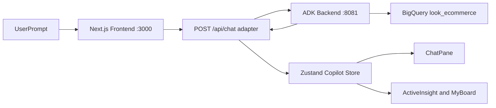

# Architecture and Technical Handoff

> **New here?** Start with the [Navigation Cheat Sheet](navigation-cheat-sheet.md) for a plain-English overview of what the project does, where the key files are, and how information flows.

## System overview

This project combines:

- **ADK backend** (`dashboard_agent`) exposed through FastAPI on `:8081`
- **Next.js frontend** on `:3000`
- **Adapter route** (`/api/chat`) that normalizes ADK output into a stable UI contract
- **Zustand store** for chat/canvas/board state



## Runtime components

- Backend entrypoint: `main.py`
- Agent package: `dashboard_agent/`
- Frontend API adapter: `frontend/app/api/chat/route.ts`
- Frontend state store: `frontend/src/store/copilotStore.ts`
- Shared UI contract types: `frontend/src/types/insight.ts`

## Frontend-backend API contract

### Request (`POST /api/chat`)

```json
{
  "prompt": "string",
  "history": [{ "role": "user|agent", "content": "string" }]
}
```

### Response (normalized for UI)

- `status`
- `response_type`: `message_only | insight_partial | insight_ready | error`
- `agent_message`
- `insight` (optional)
- `status_phase`
- `phase_trace`
- `ui_hints`
- `meta`

### SQL trust state

`insight.sql_status` explains why SQL is/is not shown:

- `available`: backend returned SQL directly
- `derived_from_text`: SQL inferred from agent text
- `missing_backend`: backend did not provide SQL
- `redacted`: SQL intentionally redacted by policy

`insight.sql_status_reason` provides user-facing detail.

## State and UX model

The UI is built around explicit response semantics:

- `message_only`: chat response, no insight payload
- `insight_partial`: partial insight data exists
- `insight_ready`: chart-capable or validated narrative+SQL insight
- `error`: request failed

Store file: `frontend/src/store/copilotStore.ts`

Main UX behavior:

- Chat remains primary for `message_only`.
- Canvas auto-opens only when `ui_hints.auto_open_insight` allows it.
- Board supports:
  - visualization-only cards (dashboard-like)
  - mixed visualization + narrative storytelling cards
- Clear board includes confirm + 10-second undo (toast action).

## Important implementation touchpoints

- Adapter normalization and classification:
  - `frontend/app/api/chat/route.ts`
- SQL rendering and fallback UX:
  - `frontend/src/components/copilot/InsightSql.tsx`
- Insight tab logic + SQL CTA gating:
  - `frontend/src/components/copilot/ActiveInsightView.tsx`
- Narrative card rendering:
  - `frontend/src/components/copilot/NarrativeInsightCard.tsx`
- Board clear and undo:
  - `frontend/src/components/copilot/MyBoardView.tsx`
  - `frontend/src/store/copilotStore.ts`
  - `frontend/src/components/GlobalToast.tsx`
  - `frontend/src/utils/ToastManager.ts`

## Local operations

### Start backend

```bash
cd playground
source .venv/bin/activate
uvicorn main:app --host 0.0.0.0 --port 8081
```

### Start frontend

```bash
cd playground/frontend
npm run dev
```

### Health checks

```bash
curl http://localhost:8081/health
curl -I http://localhost:3000
```

### Stop both

```bash
lsof -ti:3000,8081 | xargs kill -9
```

## Env configuration

`frontend/.env.local`:

```env
NEXT_PUBLIC_ADK_API_BASE_URL=http://localhost:8081
ADK_API_BASE_URL=http://localhost:8081
ADK_APP_NAME=dashboard_agent
```

## Known constraints

- Some prompts can take 25-60 seconds due to ADK+BigQuery execution latency.
- `insight_ready` can still occur with `sql_status=missing_backend` when chart-capable rows/columns are present.
- Build may warn about missing ESLint in some local environments; compilation/type-check still succeeds.

## Documentation freshness

- `docs/refactor-prd.md` was written during an earlier UAT cycle and references **Vega-Lite / Recharts** as the charting stack. The codebase has since migrated to **Nivo**. The findings and task structure in that document are still useful as historical context, but technology references should be read with this migration in mind.
