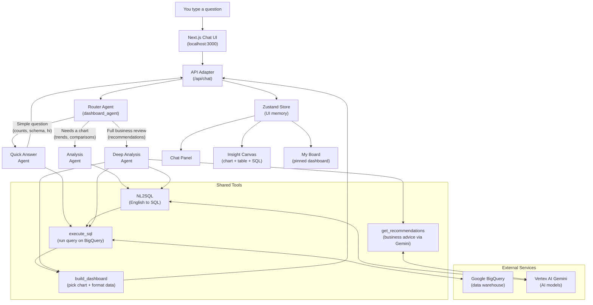

# Data Dude -- Navigation Cheat Sheet

> A plain-English guide for anyone who needs to understand what this project does,
> how it works, and where to look when something needs to change.

---

## 1. The Repo's "Elevator Pitch"

**What it does:**
Data Dude is a conversational AI copilot that lets you ask business questions in everyday English, automatically queries a BigQuery data warehouse, and returns interactive charts, data tables, and strategic recommendations -- all inside a chat + dashboard interface.

**Who it serves:**
Business analysts, product managers, or anyone who needs insights from data but doesn't want to write SQL. You type a question; the system writes the query, runs it, and visualizes the answer for you.

---

## 2. Capability Map -- What Can It Do?

| # | Capability | What happens in practice |
|---|-----------|--------------------------|
| 1 | **Natural language to SQL** | You ask "What were our top 10 products last quarter?" and the system writes and executes the SQL for you. |
| 2 | **Automatic chart generation** | The agent picks the right chart type (bar, line, scatter, pie) and sends render-ready data to the UI. |
| 3 | **Strategic recommendations** | A "deep analysis" mode adds business advice (key points + recommended actions) on top of the raw data. |
| 4 | **Pinnable dashboard board** | You can pin any insight -- chart, narrative, SQL snippet -- to a drag-and-drop board to build a data story. |
| 5 | **Multi-session chat** | Conversations are organized in sessions with history, so you can refine questions iteratively without losing context. |

---

## 3. Architecture for Humans

### How information travels from question to answer

### Reading the diagram

1. **You type a question** in the chat.
2. The **Next.js frontend** sends it to the **API adapter** (`/api/chat`), which talks to the **ADK backend**.
3. The **Router Agent** reads your question and picks the best specialist:
   - **Quick Answer** for simple lookups ("how many orders?", "what tables exist?").
   - **Analysis** when a chart would help ("revenue by region", "monthly trend").
   - **Deep Analysis** when you ask for strategic advice or a comprehensive review.
4. The specialist calls **tools** -- translating English to SQL, running the query on BigQuery, building chart data, or generating recommendations via Gemini.
5. Results flow back through the adapter into the **Zustand store**, which feeds three UI areas: the chat panel, the insight canvas (chart/table/SQL preview), and the pinnable board.

---

## 4. Where the "Brain" Is -- Key File Directory

| Folder / File | What's inside (plain English) | Importance (1-5) |
|---|---|:---:|
| `dashboard_agent/agent.py` | The "traffic cop": receives every user message and decides which specialist agent handles it. | 5 |
| `dashboard_agent/tools/bigquery.py` | Connects to BigQuery: loads the database schema on startup and translates English questions into SQL using Gemini. | 5 |
| `frontend/app/api/chat/route.ts` | The adapter layer: translates raw streaming events from the ADK backend into a clean, predictable contract the UI can consume. | 5 |
| `dashboard_agent/agents/analysis.py` | The analyst specialist: orchestrates the full SQL-to-chart pipeline for questions that need a visualization. | 5 |
| `dashboard_agent/agents/deep_analysis.py` | Same as the analyst, plus calls Gemini for business recommendations and strategic advice. | 4 |
| `dashboard_agent/tools/chart.py` | The chart builder: picks the right chart type, selects X/Y columns, and formats data for the frontend to render. | 4 |
| `dashboard_agent/callbacks.py` | The "conveyor belt": after a SQL query runs, this saves the results in session state so the next tool (chart builder) can use them. | 4 |
| `frontend/src/store/copilotStore.ts` | The UI's memory: holds chat messages, the current insight, pinned board items, and session list. All components read from here. | 4 |
| `dashboard_agent/agents/quick_answer.py` | The fast responder: handles greetings, schema questions, and single-number lookups without generating charts. | 3 |
| `dashboard_agent/tools/recommend.py` | Calls Gemini to generate structured business recommendations (summary, key points, actions). | 3 |
| `frontend/src/types/insight.ts` | The shared dictionary: defines every data shape (insight, chart metadata, response types) that the UI and API agree on. | 3 |
| `frontend/src/components/charts/NivoChart.tsx` | Renders all chart types (bar, line, scatter, pie) using the Nivo charting library. | 3 |
| `main.py` | The application entry point: starts the FastAPI server that hosts the ADK agent backend. | 2 |

---

## 5. Critical Dependencies

| Service / Technology | Role | Where it's used |
|---|---|---|
| **Google Cloud BigQuery** | The data warehouse where all business data lives. Every query runs here. | `bigquery.py`, `execute_sql` tool |
| **Google Vertex AI (Gemini)** | The AI brain that generates SQL from English, powers agent conversations, and writes recommendations. | `bigquery.py` (NL2SQL), `recommend.py`, all agent LLM calls |
| **Google ADK** | The multi-agent orchestration framework. Manages routing, tool calling, sessions, and streaming. | `agent.py`, all sub-agents, `main.py` |
| **Next.js 15** | The React framework powering the frontend (chat UI, insight canvas, dashboard board). | Everything under `frontend/` |
| **Nivo** | The charting library that renders bar, line, scatter, and pie charts in the browser. | `NivoChart.tsx`, `nivoTheme.ts` |

---

## 6. Control Question -- "Where Do I Start Looking?"

| If you want to change... | Start here |
|---|---|
| How the agent decides which specialist handles a question | `dashboard_agent/agent.py` -- edit the `_router_instructions()` function |
| How English questions are translated to SQL | `dashboard_agent/tools/bigquery.py` -- edit the `bigquery_nl2sql` function |
| What charts look like (colors, theme, sizing) | `frontend/src/components/charts/NivoChart.tsx` + `nivoTheme.ts` |
| The dashboard layout or how pinning works | `frontend/src/store/copilotStore.ts` + `frontend/src/components/copilot/MyBoardView.tsx` |
| How the backend response is translated for the UI | `frontend/app/api/chat/route.ts` |
| Which BigQuery dataset the agent can access | The `.env` file -- change `BQ_DATA_PROJECT_ID` and `BQ_DATASET_ID` |
| Which AI model is used | The `.env` file -- change `ROOT_AGENT_MODEL` (or `NL2SQL_MODEL` / `QUICK_ANSWER_MODEL` for specific agents) |
| What the agent says or how it behaves | The `_instructions()` function inside each agent file under `dashboard_agent/agents/` |

---

## Related Documentation

| Document | What it covers |
|---|---|
| [architecture.md](architecture.md) | Technical deep-dive: API contract, request/response shapes, env vars, operational commands |
| [board-ux-prd.md](board-ux-prd.md) | UX polish requirements for the dashboard board (demo readiness) |
| [refactor-prd.md](refactor-prd.md) | Historical UAT findings and refactoring tasks (note: references to Vega-Lite/Recharts are outdated -- the codebase now uses Nivo) |
