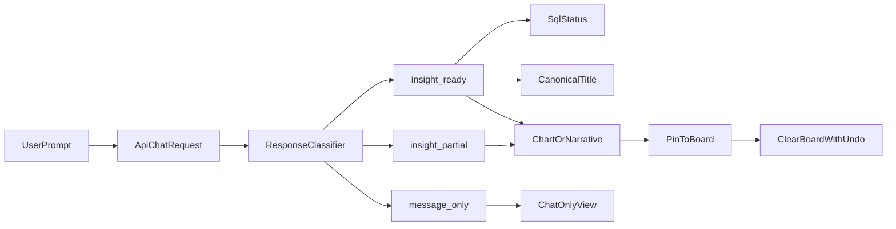

# Frontend UX Improvements PRD (Quick Wins)

## 1. Objective

Improve the end-to-end UX of the ADK-powered copilot in the next 1-2 sprints by reducing confusion between chat and canvas, improving SQL discoverability, making board storytelling clearer, and tightening recovery for slow/error paths.

This PRD focuses on tactical, high-impact changes with low-to-medium implementation risk.

## 2. Scope

In scope:
- Chat-to-canvas transition clarity
- SQL visibility and trust
- Board title/story quality
- Narrative visualization usability
- Clear-board safety and feedback
- Latency and retry UX

Out of scope:
- Full IA redesign
- Multi-page navigation changes
- New backend agent architecture

## 3. Current Experience Findings

### Evidence from recent live runs
- Narrative prompt (`hello there`) returns `message_only` as expected.
- Chart-ready prompt (`show top products by revenue`) often returns `insight_ready` with rows but empty `sql_query`.
- SQL-only prompt returns SQL and narrative mode, but response type currently allows auto-open + pin as if fully chart-ready.
- API latency for real prompts commonly ranges 25s-55s, requiring stronger progress communication.

### User-facing friction
1. Users expect SQL from visualization flows but often do not see it.
2. Board titles can be long narrative phrases instead of concise insight names.
3. Narrative card exists, but board storytelling readability is inconsistent in compact cards.
4. Clear Board works, but there is no post-action undo/recovery.

## 4. Root Cause Mapping

- Adapter contract + extraction:
  - `frontend/app/api/chat/route.ts`
- Chat and progress states:
  - `frontend/src/components/copilot/ChatPane.tsx`
  - `frontend/src/store/copilotStore.ts`
- Insight tabs and SQL visibility:
  - `frontend/src/components/copilot/ActiveInsightView.tsx`
  - `frontend/src/components/copilot/InsightSql.tsx`
- Board rendering and controls:
  - `frontend/src/components/copilot/BoardCard.tsx`
  - `frontend/src/components/copilot/MyBoardView.tsx`

## 5. UX Requirements (Must / Should / Could)

### Must
1. **SQL Trust State**
   - For every `insight_ready` response, SQL area must explicitly show one of:
     - full query,
     - redacted/derived SQL status, or
     - "not provided by backend" with reason.
2. **Response-Type Correctness**
   - `insight_ready` must only be used when at least one of:
     - chart-capable rows + columns,
     - validated SQL + narrative intent with explicit UI hint.
3. **Board Title Quality**
   - Titles must be concise (<= 80 chars), meaningful, and never equal raw prompt text.
4. **Clear Board Safety**
   - Keep confirmation and add a temporary undo toast (10 seconds).

### Should
1. Narrative cards should display summary + up to 3 key points with predictable truncation.
2. Canvas header should show user-friendly phase + elapsed time while query is in flight.
3. SQL CTA from visualization should remain visible when SQL exists.

### Could
1. Add "Regenerate title" action for pinned narrative cards.
2. Add compact "Copy SQL" button in chart/table tabs when SQL exists.

## 6. Detailed Feature Specs

### A. SQL Visibility and Fallback
**Problem:** SQL is frequently absent in chart-ready flow, which reduces trust.

**Spec:**
- Add `sql_status` field in API response metadata:
  - `available`, `missing_backend`, `derived_from_text`, `redacted`.
- In `InsightSql`, render status badge + fallback guidance.
- In `ActiveInsightView`, show SQL CTA only when `sql_status=available|derived_from_text`.

**Acceptance Criteria:**
- User can always tell whether SQL exists and why it may be missing.
- No blank SQL panel without explanation.

### B. Canonical Board Titles
**Problem:** Titles can be verbose and read like answer paragraphs.

**Spec:**
- Adapter title selection order:
  1) explicit `insight_title`/`title` from trusted payload
  2) structured summary title from tool output
  3) sanitized sentence fallback (<= 80 chars)
- Add title sanitizer:
  - remove boilerplate prefixes
  - preserve core metric/dimension terms
  - enforce length and readability

**Acceptance Criteria:**
- 95% of pinned titles are <= 80 chars and semantically distinct.
- No board title exactly matches the user prompt.

### C. Narrative Visualization (Story Card) v1
**Problem:** Storytelling is present but inconsistent between active insight and board cards.

**Spec:**
- Keep `NarrativeInsightCard` as first-class tab in Active Insight.
- In board, narrative cards show:
  - title
  - summary (2-4 lines)
  - key points (max 3)
- Ensure compact layout does not clip critical text silently.

**Acceptance Criteria:**
- Narrative-first responses remain readable when pinned.
- Board cards do not collapse into unreadable snippets.

### D. Clear Board + Undo
**Problem:** Clear action is irreversible once confirmed.

**Spec:**
- Keep confirmation dialog.
- Add undo toast with 10-second restore window.
- Persist last-cleared snapshot in-memory until timeout.

**Acceptance Criteria:**
- User can restore cleared board within 10 seconds.
- After timeout, clear is final and state persists.

## 7. UX State Flow (Target)

## 8. Sprint Plan

### Sprint 1 (High impact, low/medium effort)
1. SQL status contract + SQL panel fallback UX
2. Canonical title sanitizer + strict title length
3. Response-type tightening for auto-open/pin behavior

### Sprint 2 (Polish + safety)
1. Narrative card compact readability improvements
2. Clear Board undo flow
3. Small discoverability upgrades (copy SQL shortcuts, narrative affordances)

## 9. Success Metrics

- **SQL discoverability:** >= 90% of tested insight flows have clear SQL state in <= 2 clicks
- **Title quality:** <= 5% of board titles need manual correction
- **Latency comprehension:** >= 80% users report they understand current query phase
- **Recovery confidence:** >= 90% successful undo in clear-board undo window test

## 10. QA Checklist

- [ ] Narrative-only response stays chat-first, no forced canvas jump
- [ ] Chart-ready response has stable tab behavior
- [ ] SQL tab always shows query or explicit status reason
- [ ] Pinned board titles are concise and meaningful
- [ ] Narrative board cards remain readable
- [ ] Clear board confirmation works
- [ ] Undo after clear works within 10 seconds
- [ ] Build passes and no new lint errors in touched files
